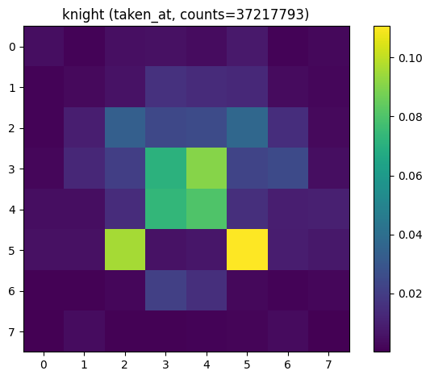
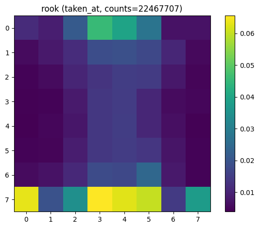
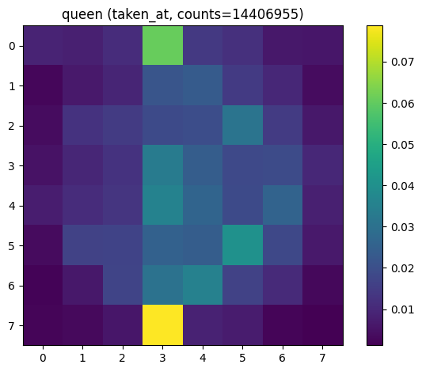
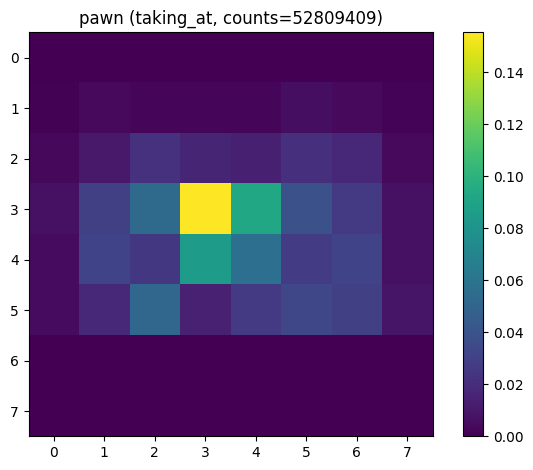
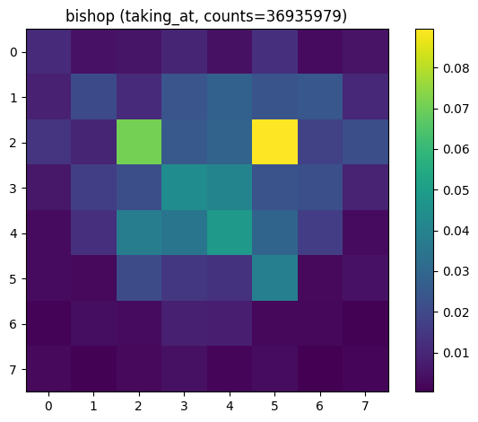
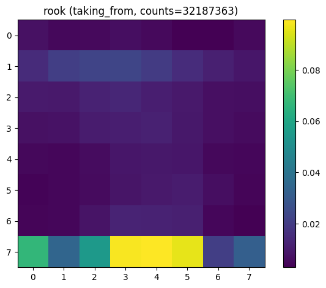

# Chess Analysis

Written by hidgjens.

Some hobby code to analyse chess databases published by [Lichess](https://lichess.org/) (database can be found [here](https://database.lichess.org/)).

## Analyses

- Capture analysis: Record every time a capture is made. Looks at the captured and capturing piece, where on the board the capture occured and where the capturing piece game from.

## Dependencies

Depends on a handful of third-party Python libraries:
- `chess`
- `matplotlib`
- `numpy`
- `pandas`
- `pyarrow`
- `tqdm`

See [requirements.txt](./requirements.txt) for versions 
used during development.

## Data processing

The Lichess databases are quite large (~10-100 GB, over 10 million games per month).

The databases are grouped by month. Each release is a single 
[.pgn](https://en.wikipedia.org/wiki/Portable_Game_Notation) file
containing millions of games.

I have attempted to write a process which batches the games from a
`.pgn` file and processes them using a processing pool.

Records are gathered and stored in a partitions parquet structure.

To create plots from the records, I read the parquet data in batches 
since I did not download enough RAM for my computer. The results
of each batch are then aggregated to create final plots.

## Example plots

NOTE: In these plots, I have mirrored the board for the black pieces.
This means that the piece positions are always taken from the 
perspective of the player.

### Pieces captured at

Location on the board where pieces are taken.
E.g., a bishop captured on C3 will record `C3`.

#### All pieces

#### Pawns

#### Knight

#### Bishop

#### Rook

#### Queen

### Where pieces make captures

Location on the board where pieces make captures.
E.g., a bishop on C3 taking on D4 will record `D4`.

#### All pieces

#### Pawns

#### Knight

#### Bishop

#### Rook

#### Queen

#### King

### Where pieces make captures from

Location on the board where pieces make capturing moves from.
E.g., a bishop on C3 taking on D4 will record `C3`.

#### All pieces

#### Pawns

#### Knight

#### Bishop

#### Rook

#### Queen

#### King

## Known issues
- There's an error in choosing when to flip the board. This has been 
  worked around temporarily by mirroring the final results.